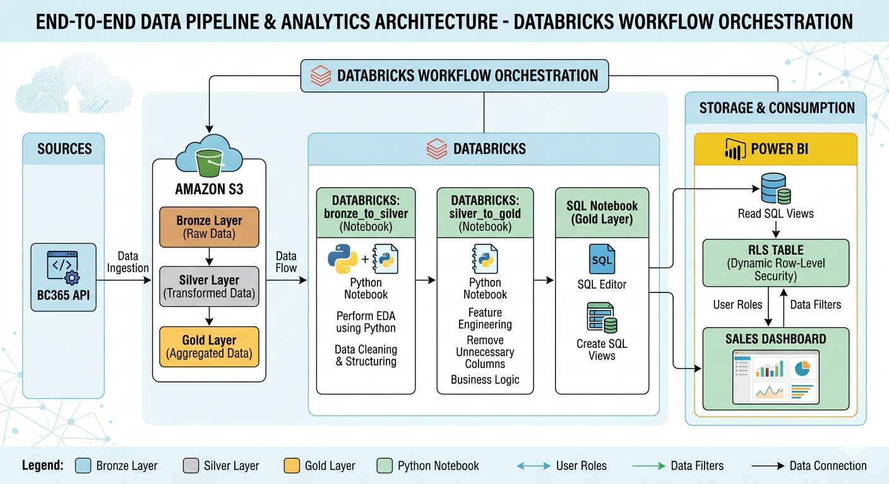
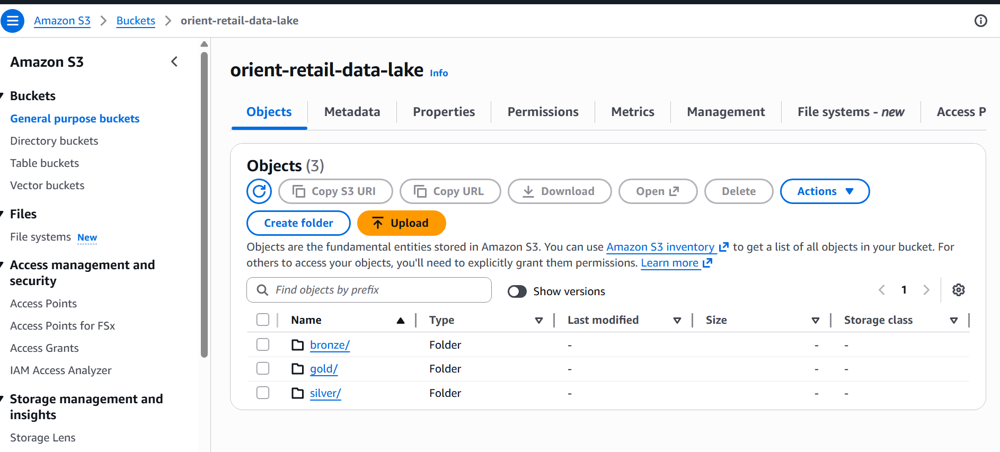
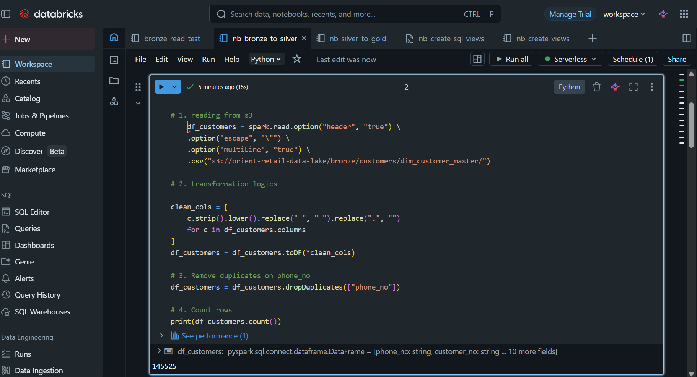
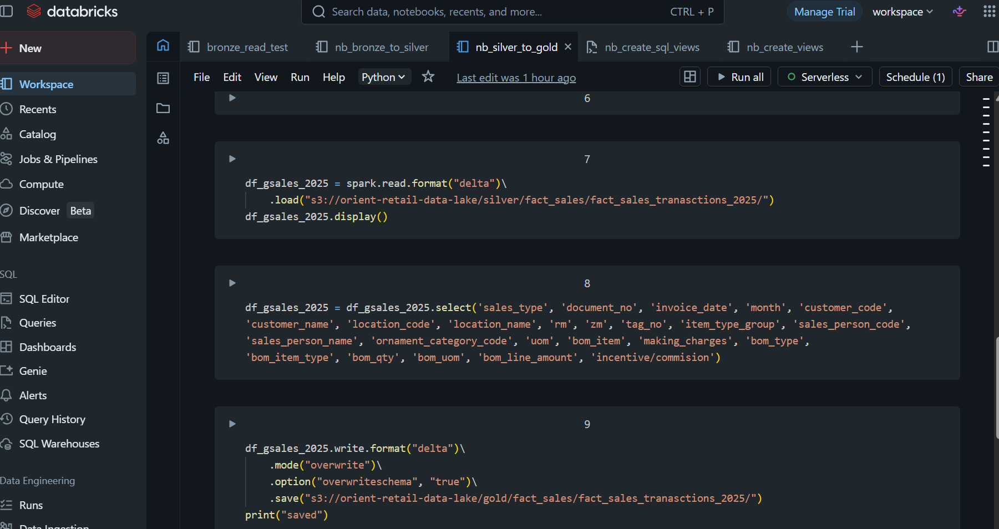
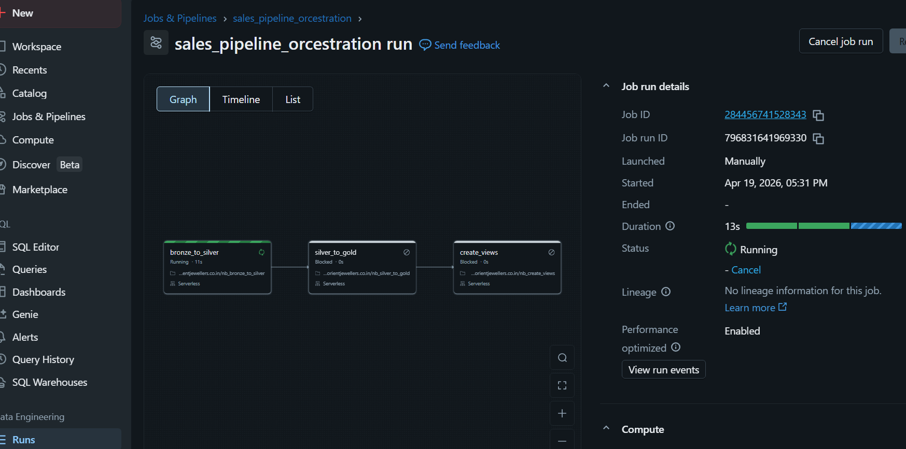
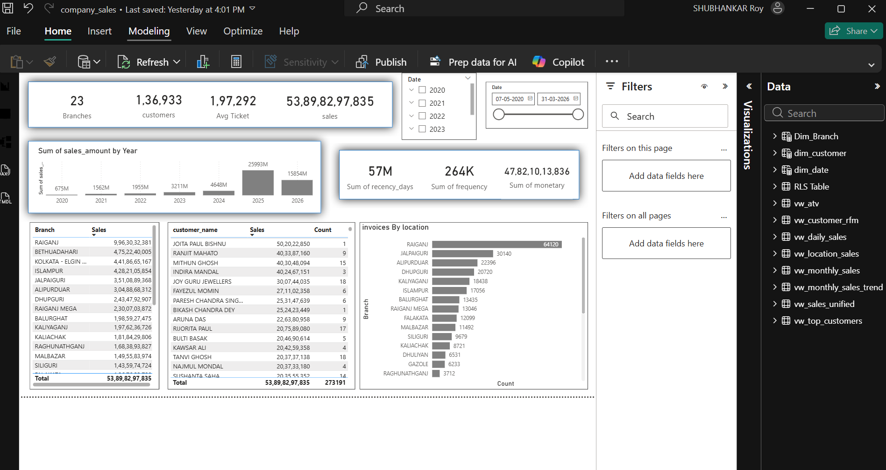
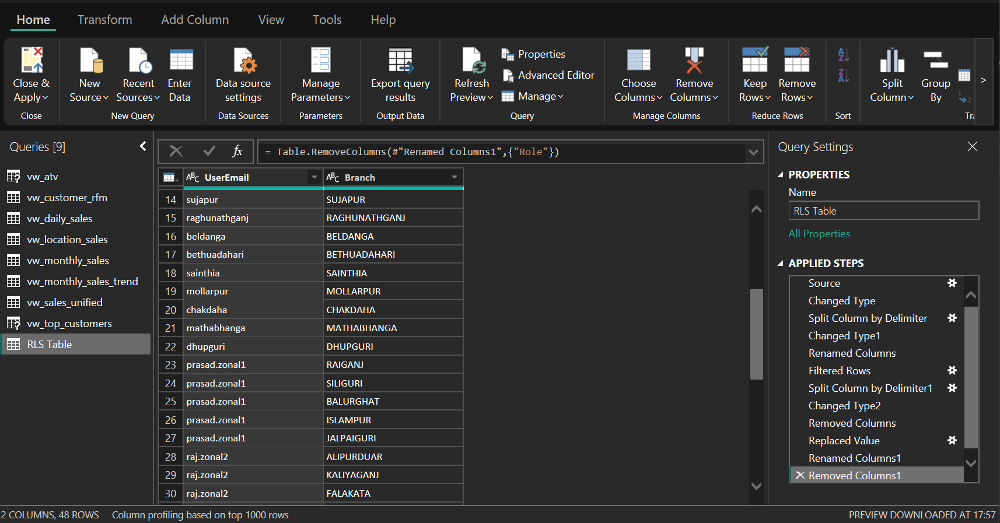
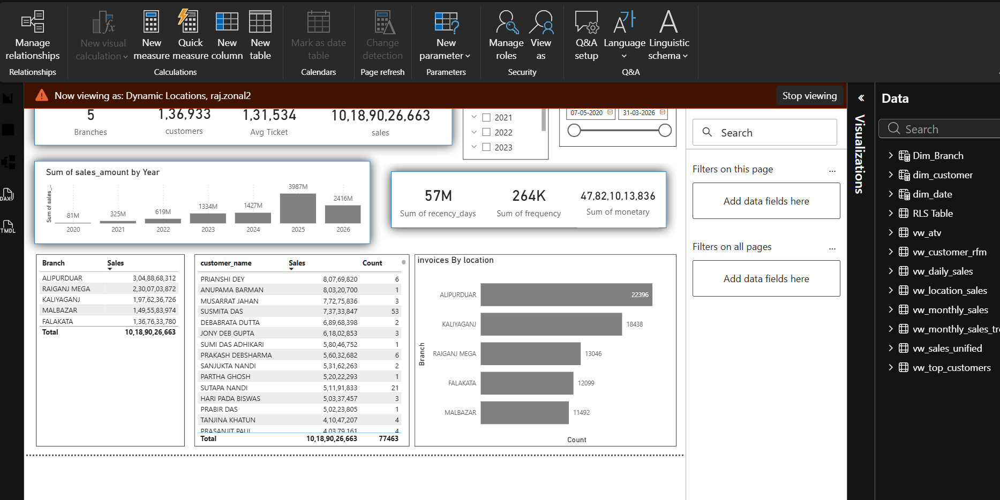

# Sales Data Pipeline – AWS S3 + Databricks

Production-style data pipeline built using AWS S3 and Databricks, following Medallion Architecture (Bronze → Silver → Gold) and orchestrated using Databricks Workflows.

---

## Tech Stack

AWS S3 • Databricks • Python • SQL • Power BI

---

## Architecture

BC365 API → AWS S3 (Bronze) → Databricks (Silver → Gold) → SQL Views → Power BI

---

## Data Lake Structure

orient-retail-data-lake/

bronze/  
silver/  
gold/  

---

## Pipeline Components

### Data Ingestion
- Data is ingested from BC365 (ERP) APIs into AWS S3 (Bronze layer)

### Data Transformation
- Bronze → Silver: Cleaning and schema standardization  
- Silver → Gold: Business transformations and modeling

### Orchestration
- Implemented using Databricks Workflows  
- Task flow:

bronze_to_silver → silver_to_gold → create_views

---

## Reporting Layer

- SQL Views created in Databricks  
- Connected to Power BI dashboards  
- Row-Level Security (RLS) implemented  

---

## Tech Stack

AWS S3  
Databricks  
Python  
SQL  
Power BI  

---

## Notes

- Dataset used is synthetic  
- Architecture reflects real production setup  

---

## Future Improvements

- Data quality checks  
- Monitoring & alerting  
- Parameterized pipelines  
